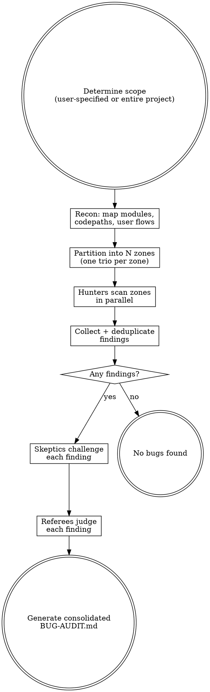

$ARGUMENTS

# Bug Audit

Adversarial bug hunting using parallel trios of competing agents.

Three roles with opposing incentives create natural tension that filters out false positives while rewarding real finds:

| Role | Scores points for | Incentive |
|------|-------------------|-----------|
| **Hunter** | Each bug reported (+10) | Find as many real bugs as possible |
| **Skeptic** | Each bug disproven (+10) | Tear apart every finding ruthlessly |
| **Referee** | — | Decide what survives into the final audit |

Multiple trios run in parallel, each covering a different codepath, module, or user flow.

## Interface

**Input:** Codebase path, optional scope constraints (specific files, module, or feature).
**Output:** Structured verdict + human-readable report. The first lines of output are always:

```
VERDICT: ISSUES_FOUND | CLEAN
ISSUE_COUNT: N confirmed, M conditional

ISSUES:
- [BUG-001] SEVERITY: High | FILE: path/to/file.py:45 | CLASS: race condition | TITLE: short description | FIX: suggested fix
- [BUG-002] ...

---
[Full narrative report below]
```

When no findings survive to CONFIRMED or CONDITIONAL, output:
```
VERDICT: CLEAN
SCOPE: N files across M modules
ZONES: N trios, N hunters, N total findings submitted, all killed or no findings
```

## Process



## Phase 1: Recon

Dispatch a recon agent (`subagent_type: "Explore"`) to map the target:

1. **Identify structure** — read build files, entry points, directory layout
2. **List all source files** — `Glob` for relevant extensions
3. **Identify natural boundaries** — packages, modules, features, user flows
4. **Note testing gaps** — areas with low or no test coverage are priority targets

The agent writes a short recon summary. This gets pasted into every hunter's prompt.

## Phase 2: Partition into Trios

Split the codebase into N zones based on natural boundaries. Each zone gets one trio (hunter + skeptic + referee). Target 3-6 trios depending on project size.

| Project size | Trios | Zone strategy |
|---|---|---|
| Small (<20 files) | 2-3 | By module/package |
| Medium (20-100 files) | 3-5 | By feature/user flow |
| Large (100+ files) | 5-6 | By subsystem/domain |

If the user specified a scope (specific files, module, or feature), use only 1-2 trios focused on that scope.

## Phase 3: Hunt (Parallel)

Spawn all hunters in parallel using the Agent tool with `subagent_type: "general-purpose"`.

Hunter prompt template:

```
You are a bug hunter in a comprehensive code audit.
Your goal: find real, demonstrable bugs. Quality over quantity — a single
well-documented confirmed bug is worth more than ten speculative ones.

PROJECT CONTEXT:
${RECON_SUMMARY}

YOUR ZONE (report findings for these files only):
${FILE_LIST}

CONSTRAINTS:
- You are READ-ONLY. Do not create, edit, or write any files. All output goes in your response.
- You MAY read files outside your zone to trace call chains and check upstream handling, but only REPORT findings for files in your zone.

INSTRUCTIONS:
For EACH file in your zone:
1. Read the file completely
2. Trace every public function's logic path — what happens with normal input?
   Edge cases? Null/empty/zero? Concurrent access? Large input?
3. Check for these bug classes:
   - LOGIC ERRORS: wrong conditions, off-by-one, inverted checks, short-circuit mistakes
   - RACE CONDITIONS: shared state without synchronization, TOCTOU, concurrent mutations
   - EDGE CASES: empty collections, null/None/undefined, zero values, max values, unicode
   - ERROR HANDLING: swallowed exceptions, wrong error types, missing cleanup on error path
   - STATE BUGS: stale state, missing resets, incorrect initialization, mutation of shared refs
   - DATA ISSUES: type coercions, silent truncation, lossy conversions, wrong encoding
   - API CONTRACT VIOLATIONS: caller/callee disagreement on nullability, return types, side effects
   - RESOURCE LEAKS: unclosed handles, missing cleanup, unbounded growth
   - BEHAVIORAL BUGS: feature doesn't match documented/expected behavior

4. For each bug found, output a finding in this EXACT format:

   FINDING: <number>
   TITLE: <short title>
   FILE: <file path>:<line number(s)>
   CLASS: <bug class from list above>
   TRIGGER: <the specific input, sequence, or condition that causes the bug>
   IMPACT: <what goes wrong — wrong result, crash, data loss, hang, etc.>
   EVIDENCE: <quote the actual code>
   END_FINDING

Do NOT grep for patterns. READ each file and THINK about its behavior.
Do NOT report style issues, missing docs, or naming preferences.
Do NOT report hypotheticals — every bug needs a concrete trigger.
Do NOT report things that are actually handled correctly elsewhere (follow the call chain to check).

WARNING: A skeptic agent will try to disprove every finding you submit.
They score points for every finding they tear apart. Make your case airtight:
show the exact code path, the exact input, and the exact wrong behavior.
Marginal findings will be killed — only report what you're confident in.

After scanning all files, output your findings using the format above.
If you found nothing, say FINDING_COUNT: 0 — don't pad with noise.
```

## Phase 4: Deduplicate

Spawn a single dedup agent that receives all hunter outputs and produces a consolidated list.

Dedup agent rules:
1. Same file + same bug = keep the strongest write-up
2. Same root cause across files = merge into one finding, cross-reference all affected files
3. Same pattern in different files with different root causes = keep as separate findings
4. When merging, combine the best evidence from each hunter
5. Err on the side of keeping findings — let the skeptic kill the weak ones
6. Output the canonical finding list using the same structured format as hunters

If a hunter returned no findings or unparseable output, note the zone as a coverage gap.

## Phase 5: Disprove (Parallel)

Group deduplicated findings by file or module. Assign each skeptic a batch of 3-5 related findings (sharing code context reduces redundant file reads). Run up to 6 skeptics in parallel. Wait for ALL skeptics to complete before starting Phase 6.

**Failure handling:** If a skeptic agent errors out or returns unparseable output, re-dispatch the batch once. If it fails again, pass its findings to the referee marked as "skeptic review unavailable."

Skeptic prompt template:

```
You are a code skeptic in a comprehensive bug audit.
Your goal: rigorously verify or refute each finding with specific evidence.
You gain nothing from a false kill — only honest, evidence-backed verdicts count.

CONSTRAINTS:
- You are READ-ONLY. Do not create, edit, or write any files.
- You have access to the full codebase via Read and Grep tools. Use them.

BUG REPORTS TO EVALUATE:
${FINDINGS_BATCH}

INSTRUCTIONS:
For EACH finding in the batch, try to prove this bug does NOT exist. Look for:

1. DEAD CODE PATH: Is this code unreachable? Behind a feature flag?
   Only called from tests? Show the call graph that proves no real
   execution path hits this.
2. HANDLED ELSEWHERE: Is there validation, normalization, or error
   handling upstream that prevents the trigger condition? Read the
   actual calling code and quote it.
3. FRAMEWORK/LIBRARY PROTECTION: Does the framework handle this case
   automatically? (ORM null checks, type coercion, auto-retry, etc.)
   Cite the specific behavior.
4. WRONG READING: Did the hunter misread the code? Confuse variables?
   Miss a conditional branch? Miss an early return? Quote the actual
   code that disproves their claim.
5. IMPOSSIBLE TRIGGER: Can the claimed trigger condition actually
   occur in practice? Are there type constraints, validation, or
   business rules that prevent it?
6. INTENTIONAL BEHAVIOR: Is this actually by design? Does the test
   suite or documentation confirm the behavior is expected?

For EACH finding, output:
FINDING_REF: <number>
VERDICT: KILLED | SURVIVED
EVIDENCE: <the specific code, logic, or documentation that supports your verdict>
WEAKNESSES: <even if SURVIVED, note any doubts or limiting conditions>
END_VERDICT

Be ruthless. If the hunter left ANY gap in their reasoning, exploit it.
But be honest — if you cannot find concrete evidence against the finding,
you MUST verdict SURVIVED. Do not manufacture objections.
```

## Phase 6: Referee (Parallel)

Group findings into batches of 3-5. Spawn one referee per batch. Run up to 6 in parallel. Wait for ALL referees to complete before proceeding to the report.

**Failure handling:** If a referee agent errors out, re-dispatch once. If it fails again, include the finding in the report as "UNREVIEWED" with the hunter's and skeptic's arguments.

Referee prompt template:

```
You are the referee in an adversarial bug audit. A hunter and a skeptic
have argued over whether a bug is real. Read both arguments and make
the final call. You score for being RIGHT — not for confirming or denying.

CONSTRAINTS:
- You are READ-ONLY. Do not create, edit, or write any files.
- You have access to the full codebase via Read and Grep tools. Use them.

PROJECT CONTEXT:
${RECON_SUMMARY}

FINDINGS TO JUDGE:
${FINDINGS_BATCH_WITH_ARGUMENTS}

For each finding, you receive:
- The hunter's case (evidence, trigger, impact)
- The skeptic's verdict (KILLED or SURVIVED) and their evidence

INSTRUCTIONS:
For EACH finding:
1. Read the contested file and surrounding code YOURSELF. Do not rely
   solely on either agent's characterization.
2. Evaluate each specific claim against the actual code.
3. Render one of these verdicts:
   - CONFIRMED: Hunter's case holds. The bug is real and triggerable.
   - NOT A BUG: Skeptic's case holds. False positive.
   - CONDITIONAL: Only a bug under specific conditions (state them).

OUTPUT per finding:
FINDING_REF: <number>
VERDICT: CONFIRMED | NOT A BUG | CONDITIONAL
REASONING: <point-by-point evaluation of both arguments>
CONDITIONS: <if CONDITIONAL, exact prerequisites>
SEVERITY: Critical | High | Medium | Low
SEVERITY_REASON: <one sentence justification>
SUGGESTED_FIX: <brief description of how to fix>
END_JUDGMENT
```

Findings with CONFIRMED or CONDITIONAL verdicts go in the final report. NOT A BUG findings are discarded.

## Phase 7: Report

Return consolidated results directly (do not write files).

**Always start with the structured verdict block** (see Interface section) so the parent workflow can parse it programmatically. Then include the full narrative report:

- **Summary**: findings submitted / killed / confirmed, severity breakdown
- **Confirmed bugs**: full detail with hunter evidence, skeptic's best objection, referee reasoning, suggested fix
- **Conditional bugs**: same format with conditions noted
- **Killed findings**: table with title, hunter, kill reason (for transparency)
- **Coverage gaps**: any zones where hunters found nothing or agents failed

## Rules

- **Read, don't grep.** Hunters read each file and reason about behavior. Pattern matching misses the interesting bugs.
- **All agents are read-only.** No agent creates, edits, or writes files. All output is in response text.
- **Concrete triggers only.** Every finding needs a specific input or condition that causes the bug. "This could be a problem" is not a finding.
- **Skeptics must be honest.** Cite specific code. If you can't disprove it, verdict SURVIVED.
- **Referees read the code independently.** Neither the hunter's nor the skeptic's characterization is trusted at face value.
- **No style nits.** This finds bugs, not formatting preferences.
- **Scope control.** The user decides scope. Default is entire project. Respect boundaries.
- **Failure handling.** If an agent errors out or returns unparseable output, re-dispatch once. If it fails again: for hunters, note the zone as a coverage gap; for skeptics, pass findings to referee marked as "skeptic review unavailable"; for referees, include findings as UNREVIEWED.
