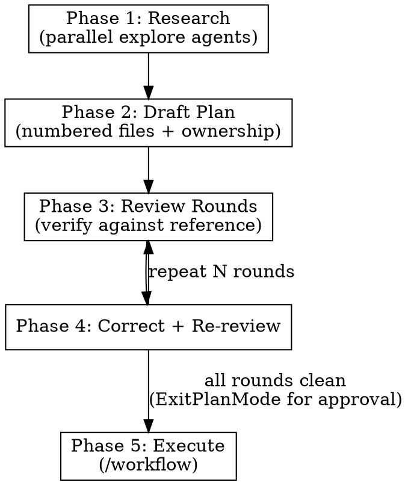
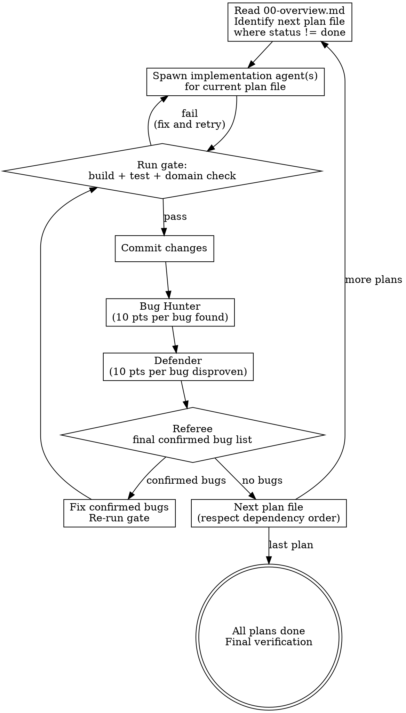

$ARGUMENTS

# Big Plan

## Overview

Research-driven planning for large tasks. Explores the codebase and any reference implementations thoroughly, writes numbered plan files with exclusive file ownership per agent, runs N review rounds to catch errors, then executes via the `/workflow` skill with built-in review and audit passes.

This skill orchestrates multi-agent research, produces multiple numbered plan files with strict TDD discipline and complete code in every step, and bakes the entire parallel execution strategy into the plans themselves.

**Announce at start:** "Using big-plan to research, plan, and prepare for parallel execution."

## When to Use

- Task touches 5+ files across multiple packages/modules
- Multiple agents could work in parallel on different subsystems
- A reference implementation or spec exists to verify against
- Getting the plan wrong would waste significant parallel effort
- You'd naturally say "let me think about this before writing code"

## When NOT to Use

- Single-file changes, bug fixes, small features
- Tasks where the approach is obvious and sequential
- No reference implementation to verify against (a simpler single-document plan may suffice)

## The Process



## Phase 1: Research

Launch 2-4 parallel explore agents. Each gets a focused question:

| Agent | Question |
|-------|----------|
| Codebase audit | What's stubbed, incomplete, or dead code in the target area? |
| Reference impl | How does the reference implementation handle each feature? |
| Data flow | Trace data through the full stack: parsing, building, output |
| Integration points | What files touch what, where are the boundaries? |

**Output:** Raw findings. Don't plan yet. Just collect facts.

## Phase 2: Draft Numbered Plan Files

Write plan files to `plans/` as numbered markdown files:

```
plans/
  00-overview.md           — Master plan: agents, phases, dependency graph
  01-<subsystem-a>.md      — Agent A's work
  02-<subsystem-b>.md      — Agent B's work
  ...
  NN-review-harness.md     — Review + audit process
```

### 00-overview.md Structure

```markdown
# [Project Name] Implementation Plan

## Agent Teams

| Agent | Files Owned (exclusive) | Dependencies |
|-------|------------------------|--------------|
| A: [Name] | `file1`, `file2` | None |
| B: [Name] | `file3`, `file4` | None |
| C: [Name] | `file5` | B (shares file3 section) |

## Execution Phases

Phase 1 (parallel): A + B
Phase 2 (parallel): C + D (after B completes)
Phase 3: Final integration verification

## Dependency Graph
[ASCII or text description of what blocks what]

## Verification
[Exact commands to run, exact expected output]
```

### Individual Plan File Structure (01-NN)

```markdown
# Plan NN: [Subsystem Name] (Agent [Letter])

**Files:**
- Create: `exact/path/to/new_file.py`
- Modify: `exact/path/to/existing.py:123-145`
- Test: `tests/exact/path/to/test.py`

## Tasks

### [Letter]1: [Task Name]

- [ ] **Step 1: Write the failing test**

\```python
def test_specific_behavior():
    result = function(input)
    assert result == expected
\```

- [ ] **Step 2: Run test to verify it fails**

Run: `pytest tests/path/test.py::test_name -v`
Expected: FAIL with "function not defined"

- [ ] **Step 3: Write minimal implementation**

\```python
def function(input):
    return expected
\```

- [ ] **Step 4: Run test to verify it passes**

Run: `pytest tests/path/test.py::test_name -v`
Expected: PASS

- [ ] **Step 5: Commit**

\```bash
git add tests/path/test.py src/path/file.py
git commit -m "feat: add specific feature"
\```

### [Letter]2: [Task Name]
[Same TDD step structure — every task follows this cycle]

## Success Criteria
- [ ] `{build_cmd}` compiles
- [ ] `{test_cmd}` passes
- [ ] [domain-specific check, e.g. parity test]

## Testing Requirements
- Command: `[exact test command]`
- Expected: [exact expected output or condition]

## Review Checklist
- [ ] No file ownership conflicts with other agents
- [ ] All edge cases from reference impl handled
- [ ] No regressions in existing behavior
```

### Key Rules for Plan Files

1. **Exclusive file ownership.** Each file belongs to exactly one agent. If two agents need the same file, one finishes first and the other runs after.
2. **Zero ambiguity.** Include exact file paths, line numbers, function names, code snippets. An agent with no context should be able to execute the plan.
3. **Success criteria are commands, not vibes.** "Compiles and passes tests" with exact commands, not "works correctly."
4. **Dependency graph is explicit.** If Agent C depends on Agent B, say exactly which files/functions and why.
5. **TDD always.** Every task follows the cycle: write failing test → verify it fails → implement → verify it passes → commit. No exceptions.
6. **Complete code in every step.** If a step changes code, show the code. No "add appropriate error handling" or "implement similar to Task N." Repeat code if needed — the executing agent may read tasks out of order.

### No Placeholders

These are plan failures — never write them:
- "TBD", "TODO", "implement later", "fill in details"
- "Add appropriate error handling" / "add validation" / "handle edge cases"
- "Write tests for the above" (without actual test code)
- "Similar to Task N" (repeat the code)
- Steps that describe what to do without showing how
- References to types, functions, or methods not defined in any task

### Self-Review

After writing all plan files, review them before starting review rounds:

1. **Spec coverage:** Skim each requirement. Can you point to a task that implements it? List gaps.
2. **Placeholder scan:** Search for any of the "No Placeholders" patterns above. Fix them.
3. **Type consistency:** Do types, method signatures, and property names in later tasks match earlier tasks? `clearLayers()` in Task 3 but `clearFullLayers()` in Task 7 is a bug.

Fix issues inline, then proceed to Phase 3 review rounds.

## Phase 3: Review Rounds

Run N rounds of verification (user specifies N, default 5). Each round launches 1-3 focused explore agents to check specific aspects of the plan against the reference implementation.

### What Each Round Checks

| Round | Focus |
|-------|-------|
| 1-2 | Data flow correctness: field names, types, byte offsets, flag values |
| 3-4 | Output format: JSON key ordering, text formatting, null handling, defaults |
| 5-6 | Edge cases: what happens with missing data, zero values, overflow |
| 7-8 | Completeness: did we miss any features, any dead code left behind |
| 9-10 | Integration: do the agents' outputs compose correctly end-to-end |

Each round produces a findings list. Fix errors in the plan files immediately, then continue to the next round.

## Phase 4: Correct and Re-review

After each round, update the plan files to fix all errors found. Then run the next round against the corrected plan. Continue until a round finds zero errors or you've completed all N rounds. Then ExitPlanMode — Claude Code handles user approval automatically.

## Phase 5: Execute (Ralph Loop)

Execution is an autonomous loop that processes plan files in order. Each plan file is one iteration. The loop does not stop until every plan file's gate passes or a gate fails and cannot be fixed.

### The Loop



### Iteration Steps

For each numbered plan file (01, 02, ... NN), in dependency order:

1. **Read the plan file.** Fresh context — only the plan file, 00-overview.md, and git history carry state between iterations.
2. **Spawn implementation agent(s).** If the plan file has independent tasks, spawn parallel agents. If sequential, one agent.
3. **Run the gate.** Every plan file defines its own gate in the Success Criteria section. The gate is a set of exact commands that must all pass:
   ```
   {build_cmd}              # compiles
   {test_cmd}               # tests pass
   {lint_cmd}               # lint clean
   [domain-specific check]  # e.g. parity test
   ```
4. **Gate fails? Fix and retry.** Do not move to the next plan file. Fix the issue, re-run the gate. Loop until the gate passes.
5. **Gate passes? Commit.** Commit all changes from this plan file as one logical unit.
6. **Adversarial Audit (3 agents).** Scoring-based adversarial review:
   - **Bug Hunter** (10 pts per confirmed bug): Reads the diff + plan file. Tries to find bugs, missed requirements, edge cases, regressions, incorrect behavior. Reports a numbered list of findings with evidence.
   - **Defender** (10 pts per disproven finding): Gets the Bug Hunter's list. Tries to disprove each finding — proving the code is actually correct, the edge case can't happen, or the requirement is met. Reports which findings are valid and which are false positives, with evidence.
   - **Referee**: Gets both reports. Produces the final verdict — a list of confirmed bugs that survived the Defender's challenge. Only these get fixed.
7. **Fix confirmed bugs, re-gate.** Fix only what the Referee confirmed. Re-run the gate. If the Referee's list was empty, skip straight to step 8.
8. **Advance to next plan file.** Check dependency graph in 00-overview.md — only start a plan file when its dependencies are marked done.

### Gate Requirements

Every plan file MUST define gates in its Success Criteria section. Gates are non-negotiable:

| Gate Type | When | Command (replace with your project's build/test/lint commands) |
|-----------|------|---------|
| Build | Every plan file | `{build_cmd}` |
| Test | Every plan file | `{test_cmd}` |
| Lint | Every plan file | `{lint_cmd}` |
| Domain | If applicable | Project-specific (parity check, integration test, etc.) |

A plan file is not done until ALL its gates pass AND reviews are clean.

### Parallel Plan Files

When the dependency graph allows it, multiple plan files can execute simultaneously (e.g., Plan 01 and Plan 02 have no shared files). Each gets its own loop iteration running in parallel, each with its own gate. The loop tracks which plan files are done and only starts dependent plan files when their prerequisites pass.

### Final Verification

After all plan files are done, run the full verification suite from 00-overview.md one final time as a cross-cutting integration check. Each plan file was already individually audited — this final pass catches issues that only emerge when all changes are combined.

## Common Mistakes

| Mistake | Fix |
|---------|-----|
| Planning without research | Phase 1 exists for a reason. You WILL get field names, defaults, and formats wrong without verifying against the reference. |
| Shared file ownership | One agent per file. Sequence agents that share files. The parallelism loss is worth the zero-conflict guarantee. |
| Skipping review rounds | Review rounds caught 6 major errors in our first use. Wrong defaults, nonexistent JSON fields, missing formatter support. Without review, all 6 would have been implemented wrong and discovered during debugging. |
| Vague success criteria | "Works correctly" is not a criterion. Exact commands with exact expected output is. |
