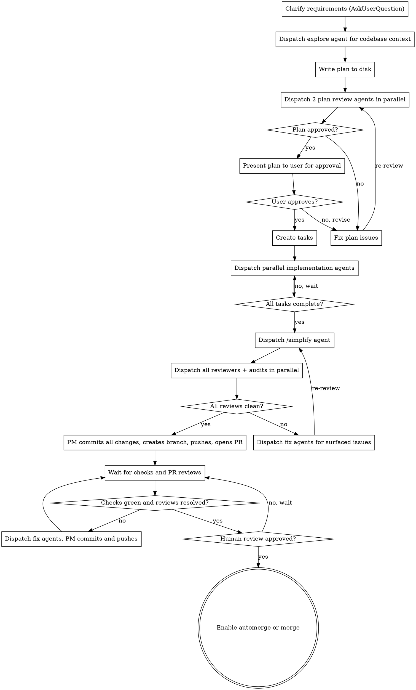

$ARGUMENTS

# Workflow

End-to-end orchestration for features and bugfixes. You are the **project manager** — you never write or review code yourself. You orchestrate agents to do everything, preserving your context window for coordination.

**The PM does not implement or review.** All code, tests, reviews, audits, and fixes are delegated to agents. You only do: clarify requirements, write the plan, dispatch agents, track progress, and manage the PR lifecycle.

## Operating Principles

- **No git in workers** — worker agents (implementation, fix, simplify) must NEVER run git commands. No commits, no branches, no stash, no rebase. All git operations are done by the PM only, at the end. This prevents workers from getting stuck in git conflicts, rebase loops, or merge hell.
- **File ownership** — no two parallel agents may modify the same file. The PM must partition file ownership in the plan and enforce it when dispatching. This includes file creation — two tasks must not create files at the same path. If two tasks need the same file, they must be sequenced, not parallelized.
- **Stay focused** — when the user fires off new asks mid-task, create a task and continue current work. Only pivot if the new ask directly modifies or cancels a running task.
- **Screenshot UI changes** — all UI changes must include screenshots. Workers use Playwright or similar tools to capture screenshots demonstrating changes.
- **Verify review findings** — before creating fixup tasks from reviewer feedback, verify reported issues are not hallucinations.
- **Plan approval for risky changes** — require explicit user approval before changes that: modify database schemas or migrations, touch auth/permissions, change core business logic, affect multiple packages, or could cause data loss.

## Process Flow

```
Clarify → Explore → Plan → Plan Review → Implement (parallel) → Simplify → Review + Audit (parallel) → Fix Loop → Commit & PR → Checks & Review → Merge
```



## Phase 1: Clarify Requirements

Use `AskUserQuestion` to gather requirements before planning. One topic per question, multiple choice when possible.

**Must establish:**
- What the feature/fix does and why
- Scope boundaries (what's in, what's out)
- Testing expectations (specific scenarios, edge cases)
- Any constraints or preferences (libraries, patterns, backwards compat)
- **If fixing a Radar bug:** capture the Radar URL (e.g. `rdar://12345678`) — it goes in the final commit message and PR body

Stop when you have enough to write a concrete plan. Don't over-interview — 2-5 questions is typical.

## Phase 2: Explore Codebase

Dispatch an explore agent (`subagent_type=Explore`) to understand the codebase before planning. The agent should report back:

- Relevant existing patterns and conventions
- Files and modules that will be affected
- Existing test patterns and infrastructure
- Dependencies and architectural constraints

This context informs the plan. Don't skip it — plans written without codebase understanding produce bad task boundaries.

## Phase 3: Write Plan

Write the implementation plan to `.claude/plans/<feature-name>.md`. The plan is a **read-only spec** — agents don't modify it. Status tracking goes through `TaskCreate`/`TaskUpdate`.

**Plan format:**

```markdown
# [Feature Name] Implementation Plan

**Goal:** [One sentence]
**Architecture:** [2-3 sentences about approach]
**Tech Stack:** [Key technologies/libraries]

---

### Task 1: [Component Name]
**Files:** Create/Modify/Test paths
**Steps:** Detailed implementation steps with code snippets
**Tests:** Required test cases (unit, integration, e2e)
**Success Criteria:**
- [ ] [Specific, verifiable outcome — e.g. "GET /api/users returns paginated results with next/prev links"]
- [ ] [Another concrete condition — e.g. "Invalid input returns 422 with field-level error messages"]
- [ ] [Test requirement — e.g. "Integration test hits real DB and verifies cascade delete"]

### Task 2: ...
```

**Every task MUST have explicit success criteria.** These are the pass/fail conditions that staff reviewers verify against in Phase 6. Without them, "completeness and correctness" review is subjective guesswork. Success criteria should be:
- **Verifiable** — a reviewer can check yes/no, not "looks good"
- **Behavioral** — describe what the system does, not how the code looks
- **Testable** — each criterion maps to at least one test case
- **Exhaustive** — cover the happy path, edge cases, and error cases

**Task requirements:**
- Each task is a parallelizable unit of work with clear file ownership
- No two tasks should modify the same file (sequence if needed)
- Every bugfix task MUST include a regression test
- Every feature task must target 80%+ coverage with a mix of unit, integration, and e2e tests — no mocking when real services are feasible
- Include exact file paths, code snippets, and test scenarios

After writing the plan, create a `TaskCreate` entry for each task. Use `TaskUpdate` to track status as agents work. This avoids merge conflicts from parallel agents editing the plan file.

## Phase 4: Plan Review

Before presenting to the user, dispatch **2 plan review agents in parallel:**

**Plan Reviewer 1 — Completeness & Feasibility:**
- Does every task have explicit, verifiable success criteria?
- Are success criteria exhaustive (happy path, edge cases, error cases)?
- Are file ownership boundaries clear with no overlaps between tasks?
- Are test requirements concrete (specific scenarios, not vague "add tests")?
- Is the task decomposition actually parallelizable, or are there hidden dependencies?
- Are there missing tasks (e.g. migrations, config changes, docs updates)?

**Plan Reviewer 2 — Technical Soundness:**
- Does the architecture make sense given the codebase exploration findings?
- Are the chosen patterns consistent with existing codebase conventions?
- Are there better approaches the plan missed?
- Are the code snippets correct and complete enough to implement from?
- Will the proposed tests actually validate the success criteria?
- Any security, performance, or scalability concerns with the approach?

Each reviewer outputs specific issues or "APPROVED". **Iterate:** fix all issues raised, re-dispatch both reviewers, repeat until both approve.

Only after both reviewers approve, present the plan to the user for final approval. If the user requests changes, revise and re-run plan review.

## Phase 5: Parallel Implementation

Dispatch implementation agents in parallel — one per independent task. Use the Agent tool with appropriate `subagent_type` (python-expert, react-frontend-architect, general-purpose, etc.).

**CRITICAL: No git commands in worker agents.** Workers only write code and run tests. All git operations (branch creation, commits, push, PR) are handled by the PM in Phase 8. This prevents workers from getting stuck in git conflicts, rebase loops, or other git hell.

**Rules:**
- Max 5 parallel implementation agents at a time (max 10 total parallel tasks across all roles)
- Each agent receives: full task text from plan, relevant context, file ownership boundaries
- **Workers must NOT run any git commands** — no `git add`, `git commit`, `git checkout`, `git branch`, `git stash`, `git rebase`, nothing. Zero git commands.
- Each agent must write tests meeting coverage requirements (80%+, mix of unit/integration/e2e, no mocking)
- Bugfixes MUST include a regression test that fails without the fix
- PM tracks progress via `TaskUpdate` — mark tasks in_progress when dispatched, completed when done

**Agent prompt template:**

```
You are implementing Task N from the plan.

YOUR TASK:
[Full task text from plan]

RULES:
1. Write tests: 80%+ coverage, mix of unit/integration/e2e, NO mocking — use real services
2. Bugfixes MUST include a regression test that fails without the fix
3. DO NOT RUN ANY GIT COMMANDS. No git add, commit, checkout, branch, stash, rebase, or any other git command. The PM handles all git operations.
4. Only modify files listed in your task — do not touch other tasks' files
5. Run tests and verify they pass before finishing
```

## Phase 6: Review

After all implementation agents finish:

First, dispatch **`/simplify`** on all changed files. Clean up the code before reviewers spend time on it.

Then dispatch **all 5 review passes in parallel** (note: `/bug-audit`, `/exploit-finder`, and `/perf-audit` each spawn their own hunter/skeptic/referee trio internally — expect ~11 agents total):

1. **Staff Review — Completeness & Correctness:**
   - Walk through every task's **success criteria** checklist — is each criterion met? Check the boxes.
   - Any success criterion not met = the implementation is incomplete. No exceptions.
   - Every bugfix has a regression test that fails without the fix
   - Every feature has e2e and integration tests (not just unit tests)
   - Test scenarios cover happy path, error cases, and edge cases
   - No mocking when real services are feasible
   - Security concerns (OWASP top 10)?

2. **Staff Review — Code Quality & Architecture:**
   - Clean, readable, well-structured? DRY? YAGNI?
   - Good naming? No obvious perf issues? Appropriate error handling?

3. **`/bug-audit`** — on the full diff (spawns 3 agents: hunter, skeptic, referee)

4. **`/exploit-finder`** — on the full diff (spawns 3 agents: hunter, skeptic, referee)

5. **`/perf-audit`** — on the full diff (spawns 3 agents: hunter, skeptic, referee)

Each reviewer outputs a structured list of issues, or "APPROVED" if clean.

## Phase 7: Fix Loop

Collect ALL issues from: simplify, staff reviews, bug-audit, exploit-finder, and perf-audit.

**If any issues exist:**
1. Group all issues by affected file(s) — never dispatch two fix agents touching the same file
2. Dispatch one fix agent per file-group (parallel where possible). **Fix agents must NOT run any git commands** — same rule as implementation agents.
3. After fixes, re-run the full review cycle (Phase 6)
3. Repeat until all reviewers and audits return APPROVED
4. Do NOT skip re-review — every fix must be validated

**This loop is mandatory.** No issue may be left unaddressed.

## Phase 8: Commit, Branch & Create PR

**This is the ONLY phase where git commands are run.** The PM (top-level agent) handles all git operations here, after all code changes are complete and reviewed.

```bash
# Determine the default/upstream branch
git remote show origin | grep 'HEAD branch' | awk '{print $NF}'

# Fetch latest
git fetch origin

# Create feature branch from current HEAD (preserves uncommitted changes)
git checkout -b <feature-branch>

# Stage and commit all worker changes
git add -A
git commit -m "<descriptive commit message>"

# Rebase onto latest upstream so the PR is clean
git rebase origin/<default-branch>
```

**If fixing a Radar bug:** the commit message must include the Radar URL (e.g. `Fix crash when parsing nil response\n\nrdar://12345678`).

Use the `/gh` skill -- follow its "Writing PR Descriptions" section. Run `/humanizer` on the PR title and description before creating.

```bash
git push -u origin <feature-branch>

cat > /tmp/pr-body.md <<'EOF'
<one sentence: why this change exists>

<short bullets or paragraphs broken by logical area, not by file.
no formulaic headers. no counting things. keep it scannable.
weave in testing context naturally.>

<rdar://XXXXXXXXX if applicable>
EOF

gh pr create --title "<concise title>" --body-file /tmp/pr-body.md
```

## Phase 9: CI Checks & PR Review

**Post-PR fix loop** — the PM is the only one who commits and pushes:

1. Wait for CI: `gh pr checks --watch`
2. Read reviews: `gh pr view --json reviews,reviewThreads`
3. If all checks green AND all threads resolved AND approved → proceed to Phase 10
4. Otherwise: dispatch fix agent(s) for failures/comments — **fix agents must NOT run any git commands**
5. After fix agents complete, PM commits and pushes:
   ```bash
   git add -A
   git commit -m "<describe fixes>"
   git push
   ```
6. Reply to and resolve addressed review threads
7. Go to step 1

**If checks fail:** investigate root cause (use `/rio` skill for Rio CI) before dispatching fix agents.

**Iterate until:** all checks green, all threads resolved, all concerns addressed.

## Phase 10: Merge

**Path A — Automerge (preferred when repo supports it):**
```bash
gh pr merge <pr-number> --auto --squash --delete-branch
```

**Path B — Wait for human approval:**
If the repo requires human review beyond devx-ai, wait for a human to approve, then:
```bash
gh pr merge <pr-number> --squash --delete-branch
```

**After merge:**
- Clean up feature branch and worktree
- Delete the plan file: `rm .claude/plans/<plan-file>.md`
- Confirm to the user

## Role Catalog

| Role | Max Parallel | Description |
|------|--------------|-------------|
| **Explore** | 1 | Codebase exploration before planning. Reports patterns, conventions, affected files. |
| **Plan Review** | 2 | Reviews plan for completeness, feasibility, and technical soundness. |
| **Implementation** | 5 | Write code and tests. Assign clear file ownership: frontend, backend, API, tests, migrations, etc. No git. |
| **Simplify** | 1 | Code cleanup via `/simplify` on changed files. Runs before reviews. No git. |
| **Staff Engineer Review** | 2 | Review for completeness/correctness (success criteria) and code quality/architecture. |
| **Audit** | 3 | `/bug-audit`, `/exploit-finder`, `/perf-audit` — each spawns hunter/skeptic/referee internally. |
| **Fix** | 5 | Address issues from reviews and audits. Grouped by file to prevent conflicts. No git. |

## Red Flags

**Never:**
- Write or review code yourself — always delegate to agents
- **Let worker agents run ANY git commands** — all git (branch, commit, push) is done by the PM only, in Phase 8 and the Phase 9 fix loop
- Skip the fix loop — every issue must be addressed and re-reviewed
- Merge with failing checks or unresolved reviews
- Push without the user's knowledge
- Skip regression tests for bugfixes
- Accept mocked tests when real integration tests are feasible
- Treat devx-ai approval as sufficient — wait for human review if repo requires it
- Let parallel agents edit the plan file (use TaskUpdate for status)
- Dispatch two agents that touch the same file in parallel

**Always:**
- Explore the codebase before writing the plan
- Use TaskCreate/TaskUpdate for progress tracking
- Parallelize where possible (implementation, reviews + audits together)
- Re-run full review cycle after fixes
- Confirm with user before pushing and before merging
