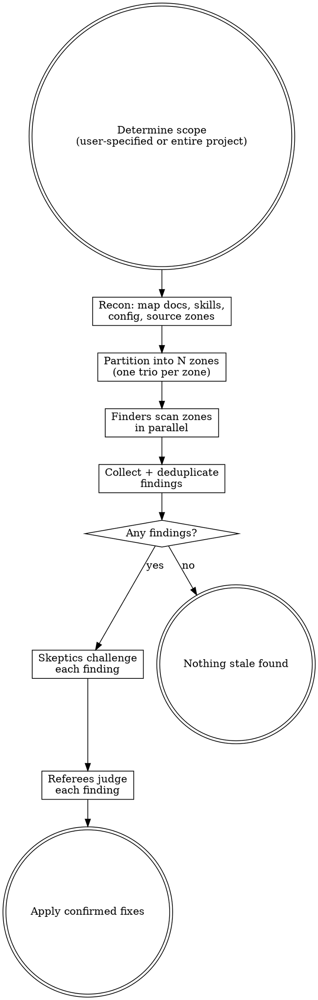

$ARGUMENTS

# Freshen

Adversarial staleness hunting using parallel trios of competing agents.

Three roles with opposing incentives filter out false positives while catching real staleness:

| Role | Scores points for | Incentive |
|------|-------------------|-----------|
| **Finder** | Each stale item reported (+10) | Find as many genuinely stale comments/docs as possible |
| **Skeptic** | Each finding disproven (+10) | Prove the comment/doc is actually still correct |
| **Referee** | — | Decide what gets fixed in the final pass |

Multiple trios run in parallel, each covering a different zone of the codebase.

**You are an orchestrator.** Do not read code or make edits yourself. Delegate all work to parallel agents using the Agent tool.

## What Counts as Stale

1. **Wrong references** — comments mentioning functions, classes, variables, files, or CLI commands that no longer exist or were renamed
2. **Outdated docstrings** — parameter lists that don't match the current function signature, return type descriptions that are wrong
3. **Resolved TODOs/FIXMEs** — TODO comments where the described work is already done
4. **Broken cross-references** — doc links pointing to moved/deleted files, `see also` references to removed functions
5. **Stale inline comments** — comments describing logic that has since changed (e.g., "we retry 3 times here" but the code now retries 5 times)
6. **Outdated doc pages** — documentation referencing removed features, old CLI syntax, renamed fields, or deprecated configuration
7. **Stale skills/plugins** — skill descriptions, trigger keywords, or tool references that don't match current behavior
8. **Stale config references** — READMEs, setup guides, or config examples referencing options, env vars, or paths that no longer exist

## What NOT to Touch

- Do not rewrite comments for style or grammar — only fix factual inaccuracies
- Do not add new comments or docstrings where none exist
- Do not refactor code, only update comments and documentation
- Do not modify test assertions or test logic — only test comments/docstrings
- Do not touch auto-generated files (codegen output, migration files, vendored code)

## Process



## Phase 1: Recon

Map the project to determine how to partition work:

1. **Identify structure** — read build files, entry points, directory layout
2. **Discover documentation surfaces** — search for all of these:
   - Doc directories (`docs/`, `doc/`, `documentation/`, `wiki/`, `guides/`)
   - README files at any depth (`**/README*`, `**/readme*`)
   - Skills/plugins (`**/skills/`, `**/plugins/`, `**/.claude/`, `**/SKILL.md`)
   - Config files with descriptions (`*.yaml`, `*.yml`, `*.toml`, `*.json` that contain human-readable descriptions or comments)
   - Changelogs (`CHANGELOG*`, `CHANGES*`, `HISTORY*`)
   - Contributing guides (`CONTRIBUTING*`)
   - API docs (OpenAPI specs, generated doc folders)
   - Inline doc systems (docstrings, JSDoc, rustdoc, godoc)
3. **List all source files** — `Glob` for relevant extensions
4. **Identify natural boundaries** — packages, modules, features, layers
5. **Note doc-heavy areas** — areas with lots of comments or documentation are priority targets

Write a short recon summary including the full list of discovered documentation surfaces. This gets pasted into every finder's prompt.

## Phase 2: Partition into Trios

Split the codebase into N zones based on natural boundaries. Each zone gets one trio (finder + skeptic + referee). Target 3-6 trios depending on project size.

| Project size | Trios | Zone strategy |
|---|---|---|
| Small (<20 files) | 2-3 | By module/package |
| Medium (20-100 files) | 3-5 | By feature/layer |
| Large (100+ files) | 5-6 | By subsystem/domain |

If the user specified a scope (specific files, module, or feature), use only 1-2 trios focused on that scope.

**Always** create a dedicated zone for documentation surfaces (docs folders, READMEs, skills, changelogs) — these are highest priority.

## Phase 3: Find (Parallel)

Spawn all finders in parallel using the Agent tool with `subagent_type: "general-purpose"`.

Finder prompt template:

```
You are a staleness finder in a comprehensive documentation audit.
You SCORE POINTS for every genuinely stale item you find: +10 per finding.
Your goal: find as many real, provable instances of stale documentation as possible.

PROJECT CONTEXT:
${RECON_SUMMARY}

YOUR ZONE:
${FILE_LIST}

INSTRUCTIONS:
For EACH file in your zone, follow these steps IN ORDER:

STEP 1 — TODO/FIXME sweep
  Grep for all TODO, FIXME, HACK, XXX comments. For each one, read the
  surrounding code and check if the described work is already done.

STEP 2 — Docstring vs signature verification
  For every function/method with a docstring containing Args/Parameters/Returns,
  verify that the listed params match the actual function signature.
  Check return type descriptions against the actual return type annotation.

STEP 3 — File path references
  Grep for file paths in comments and docs (patterns like `path/to/file`,
  `/packages/`, `src/`, common extensions). Verify each referenced file exists.

STEP 4 — Function/class name references
  Check comments that reference specific function or class names (e.g.,
  "see FooBar()", "calls do_thing()"). Verify the referenced name exists
  in the codebase.

STEP 5 — Numeric/count claims
  Look for comments claiming specific counts, lists, or enumerations
  (e.g., "three handlers", "supports 4 types", "5 fields"). Verify the
  number matches the actual code.

STEP 6 — Terminology consistency
  Check for project-specific terms that may have been renamed. Look for
  comments using old names for functions, classes, CLI commands, or concepts.
  Cross-reference with recent git history if uncertain.

STEP 7 — Doc page accuracy (for docs/READMEs/skills/config files)
  Read each doc page and verify:
  - CLI commands and flags mentioned actually exist
  - Configuration options described are still valid
  - Feature descriptions match current behavior
  - Setup instructions reference correct paths and tools
  - Skill descriptions and trigger keywords match actual behavior

For each stale item found, write a finding with:
  - Title
  - File path and line number(s)
  - Staleness class (TODO resolved, wrong params, broken path, etc.)
  - Evidence: quote the stale text AND the current code/state that contradicts it
  - Suggested fix: what the text should say instead (or "remove")

Do NOT report style issues, grammar, or formatting preferences.
Do NOT report hypotheticals — every finding needs concrete evidence of staleness.
Do NOT report things where you're unsure if the reference is stale.

WARNING: A skeptic agent will try to disprove every finding you submit.
They score points for every finding they tear apart. Make your case airtight:
show the exact stale text, the exact current code, and why they conflict.

After scanning all files, output your findings as a numbered list.
If you found nothing, say so — don't pad with noise.
```

## Phase 4: Deduplicate

After all finders complete, collect findings:

1. Same file + same stale item = keep the strongest write-up
2. Same root cause across files (e.g., a renamed function referenced in multiple places) = merge into one finding
3. When merging, combine the best evidence from each finder

## Phase 5: Disprove (Parallel)

For each deduplicated finding, spawn a skeptic. Run up to 6 in parallel.

Skeptic prompt template:

```
You are a documentation skeptic in a comprehensive staleness audit.
You SCORE POINTS for every staleness report you INVALIDATE: +10 per kill.
Your goal: prove this reported staleness is NOT actually a real issue.

STALENESS REPORT:
- Title: ${TITLE}
- File: ${FILE_PATH}:${LINE}
- Staleness class: ${CLASS}
- Claimed evidence: ${EVIDENCE}
- Suggested fix: ${FIX}

INSTRUCTIONS:
Try your hardest to prove this comment/doc is NOT actually stale. Look for:

1. REFERENCE STILL VALID: Does the referenced function, file, or concept
   actually still exist — maybe under a slightly different name, in a
   different module, or re-exported? Search thoroughly.
2. CORRECT IN CONTEXT: Is the comment describing intended/planned behavior
   rather than current behavior? Is it aspirational or a design note?
   Check git blame for context on why it was written.
3. STILL ACCURATE: Did the finder misread the code? Does the described
   behavior actually match what the code does? Read the actual
   implementation path carefully.
4. DIFFERENT SCOPE: Is the comment referring to a different layer, service,
   or deployment context where the described behavior IS still true?
5. TODO STILL RELEVANT: For TODO/FIXME findings — is the work actually
   NOT done yet? Is there a partial implementation? Check thoroughly.
6. DOC IS CORRECT: For doc page findings — does the documented behavior
   actually match? Maybe the finder read the wrong version of the code
   or missed a config option that enables the described behavior.

OUTPUT:
- VERDICT: KILLED (not actually stale) or SURVIVED (couldn't disprove it)
- EVIDENCE: the specific code, logic, or context that supports your verdict
- WEAKNESSES: even if SURVIVED, note any doubts or limiting conditions

Be ruthless. If the finder left ANY gap in their reasoning, exploit it.
But be honest — don't manufacture objections. A false kill is worse than no kill.
```

## Phase 6: Referee (Parallel)

For each finding that went through finder/skeptic, spawn a referee. Run up to 6 in parallel.

Referee prompt template:

```
You are the referee in an adversarial staleness audit. A finder and a skeptic
have argued over whether a comment or doc is stale. Read both arguments and
make the final call.

FINDING:
- Title: ${TITLE}
- File: ${FILE_PATH}:${LINE}
- Staleness class: ${CLASS}

FINDER'S CASE:
${FINDER_ARGUMENT}

SKEPTIC'S CASE:
${SKEPTIC_ARGUMENT}

INSTRUCTIONS:
1. Read the contested file and surrounding code YOURSELF. Do not rely
   solely on either agent's characterization.
2. Evaluate each specific claim against the actual code.
3. Render one of these verdicts:
   - STALE: Finder's case holds. The comment/doc is factually wrong.
   - NOT STALE: Skeptic's case holds. False positive.
   - CONDITIONAL: Only stale in certain contexts (state them).

For STALE verdicts, also provide:
   - The exact edit to make (old text -> new text, or "remove")
   - Whether the fix is safe to apply automatically or needs human review

OUTPUT:
- VERDICT: STALE / NOT STALE / CONDITIONAL
- REASONING: point-by-point evaluation of both arguments
- CONDITIONS: (if CONDITIONAL) exact circumstances
- FIX: (if STALE) exact replacement text or "remove"
- AUTO-SAFE: yes/no — can this be applied without human review?
```

Findings with STALE or CONDITIONAL verdicts proceed to the fix phase. NOT STALE findings are discarded.

## Phase 7: Apply Fixes

Spawn a single agent to apply all confirmed fixes:

```
You are the fix applicator for a staleness audit. Apply these confirmed fixes
to the codebase. For each fix:

1. Read the file and locate the exact stale text
2. Apply the fix (edit or remove)
3. Verify the surrounding context still makes sense after the edit
4. If a fix marked AUTO-SAFE=no, skip it and add to the manual review list

CONFIRMED FIXES:
${FIXES_LIST}

After applying all fixes, output:
- Number of files changed
- Number of fixes applied vs skipped
- List of any fixes that need manual review (with file path and reason)
```

## Phase 8: Report

Return consolidated results directly (do not write files). Structure:

- **Summary**: findings submitted / killed / confirmed, staleness class breakdown
- **Scoreboard**: points per agent
- **Confirmed fixes**: full detail with finder evidence, skeptic's best objection, referee reasoning, fix applied
- **Conditional fixes**: same format with conditions noted
- **Manual review needed**: items referees flagged as not auto-safe
- **Killed findings**: table with title, finder, kill reason (for transparency)

## Targeting Specific Sections

If the user specifies a scope, only run trios for that scope:

- `/freshen docs` — only documentation surfaces
- `/freshen src/api` — only the API layer
- `/freshen all` or just `/freshen` — entire project

Multiple scopes can be comma-separated: `/freshen models,docs`

## Rules

- **Read, don't pattern-match.** Finders read each file and reason about accuracy. Grepping for TODO alone misses the interesting staleness.
- **Concrete evidence only.** Every finding needs the stale text AND the current code that contradicts it. "This might be wrong" is not a finding.
- **Skeptics must be honest.** Manufacturing false objections poisons the process. Cite specific code.
- **Referees read the code independently.** Neither the finder's nor the skeptic's characterization is trusted at face value.
- **No style nits.** This finds factual inaccuracies, not formatting preferences.
- **Scope control.** The user decides scope. Default is entire project. Respect boundaries.
- **Only fix facts.** Do not rewrite for grammar, style, or clarity — only correct factual errors.
