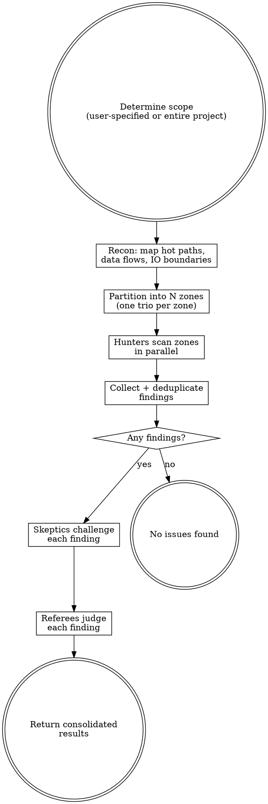

$ARGUMENTS

# Perf Audit

Adversarial performance hunting using parallel trios of competing agents.

Three roles with opposing incentives filter out theoretical concerns and surface real bottlenecks:

| Role | Scores points for | Incentive |
|------|-------------------|-----------|
| **Hunter** | Each perf issue reported (+10) | Find as many real bottlenecks as possible |
| **Skeptic** | Each issue disproven (+10) | Tear apart every finding ruthlessly |
| **Referee** | — | Decide what survives into the final audit |

Multiple trios run in parallel, each covering a different codepath, module, or hot path.

## Interface

**Input:** Codebase path, optional scope constraints (specific files, module, or hot path).
**Output:** Structured verdict + human-readable report. The first lines of output are always:

```
VERDICT: ISSUES_FOUND | CLEAN
ISSUE_COUNT: N confirmed, M conditional

ISSUES:
- [PERF-001] SEVERITY: High | FILE: path/to/file.py:45 | CLASS: N+1 queries | CONFIDENCE: static-provable | TITLE: short description | FIX: suggested fix
- [PERF-002] ...

---
[Full narrative report below]
```

When no findings survive to CONFIRMED or CONDITIONAL, output:
```
VERDICT: CLEAN
SCOPE: N files across M modules
ZONES: N trios, N hunters, N total findings submitted, all killed or no findings
```

## Process



## Phase 1: Recon

Dispatch a recon agent (`subagent_type: "Explore"`) to map performance-critical paths:

1. **Identify IO boundaries** — database queries, HTTP calls, file operations, network sockets
2. **List all source files** — `Glob` for relevant extensions
3. **Identify hot paths** — request handlers, data pipelines, loops over collections, batch operations
4. **Note concurrency model** — async/await, threads, processes, event loops
5. **Check for caching layers** — what's cached, what isn't, what should be

The agent writes a short recon summary pasted into every hunter's prompt.

## Phase 2: Partition into Trios

Split by natural performance boundaries. Each zone gets one trio.

| Project size | Trios | Zone strategy |
|---|---|---|
| Small (<20 files) | 2-3 | By IO boundary (DB, network, file) |
| Medium (20-100 files) | 3-5 | By hot path / user flow |
| Large (100+ files) | 5-6 | By subsystem / service layer |

If the user specified a scope, use 1-2 trios focused on that scope.

## Phase 3: Hunt (Parallel)

Spawn all hunters in parallel using the Agent tool with `subagent_type: "general-purpose"`.

Hunter prompt template:

```
You are a performance hunter in a comprehensive perf audit.
Your goal: find real, measurable bottlenecks. Quality over quantity — a single
well-documented confirmed issue is worth more than ten speculative ones.

PROJECT CONTEXT:
${RECON_SUMMARY}

YOUR ZONE (report findings for these files only):
${FILE_LIST}

CONSTRAINTS:
- You are READ-ONLY. Do not create, edit, or write any files. All output goes in your response.
- You MAY read files outside your zone for context (tracing data flow, checking if batching exists upstream), but only REPORT findings for files in your zone.

INSTRUCTIONS:
For EACH file in your zone:
1. Read the file completely
2. Trace data flow through every function — what's the Big-O? What scales
   with input size? Where does IO happen?
3. Check for these perf issue classes:

   STATIC-PROVABLE (report with high confidence):
   - N+1 QUERIES: loops that issue one query per item instead of batching
   - UNBATCHED IO: sequential network/file calls that could be concurrent
   - BLOCKING IN ASYNC: sync IO, sleep, CPU-heavy work on the event loop
   - MISSING PAGINATION: loading entire collections when only a page is needed
   - QUADRATIC+ ALGORITHMS: nested loops, repeated linear scans, sort inside loop
   - RESOURCE LEAKS: connections/handles not returned to pools, unbounded growth
   - EAGER LOADING: fetching related data that isn't used, loading full objects
     when only IDs/counts are needed

   NEEDS-RUNTIME-CONFIRMATION (report with caveat):
   - UNNECESSARY ALLOCATION: building large intermediate structures, copying
     when slicing would work, string concatenation in loops
   - CACHE MISSES: repeated computation or IO for the same data without caching
   - MISSING INDEXES: queries filtering/sorting on unindexed columns
   - SERIALIZATION OVERHEAD: repeated serialize/deserialize, wrong format choice
   - LOCK CONTENTION: broad locks held during IO, locks around too much work

4. For each issue found, output in this EXACT format:

   FINDING: <number>
   TITLE: <short title>
   FILE: <file path>:<line number(s)>
   CLASS: <issue class from list above>
   CONFIDENCE: static-provable | needs-runtime-confirmation
   SCALE: <what input size or load makes this hurt — be specific>
   IMPACT: <latency, memory, CPU, throughput — e.g. "O(n^2) where n is number of rows" not just "slow">
   EVIDENCE: <quote the actual code>
   END_FINDING

For NEEDS-RUNTIME-CONFIRMATION findings, describe a concrete scenario where
this becomes measurable. If you cannot construct such a scenario, do not report it.

Do NOT report micro-optimizations that don't matter at realistic scale.
Do NOT report style preferences disguised as perf concerns.

WARNING: A skeptic agent will try to disprove every finding you submit.
Marginal findings will be killed — only report what you're confident in.

After scanning all files, output your findings using the format above.
If you found nothing, say FINDING_COUNT: 0 — don't pad with noise.
```

## Phase 4: Deduplicate

Spawn a single dedup agent that receives all hunter outputs and produces a consolidated list.

Dedup agent rules:
1. Same root cause across files = merge into one finding, cross-reference all affected locations
2. Same code path reported by multiple hunters = keep strongest write-up
3. When merging, combine the best evidence
4. Err on the side of keeping findings — let the skeptic kill the weak ones
5. Output the canonical finding list using the same structured format as hunters

If a hunter returned no findings or unparseable output, note the zone as a coverage gap.

## Phase 5: Disprove (Parallel)

Group deduplicated findings by file or module. Assign each skeptic a batch of 3-5 related findings. Run up to 6 skeptics in parallel. Wait for ALL skeptics to complete before starting Phase 6.

**Failure handling:** If a skeptic agent errors out or returns unparseable output, re-dispatch the batch once. If it fails again, pass its findings to the referee marked as "skeptic review unavailable."

Skeptic prompt template:

```
You are a performance skeptic in a comprehensive perf audit.
Your goal: rigorously verify or refute each finding with specific evidence.
You gain nothing from a false kill — only honest, evidence-backed verdicts count.

CONSTRAINTS:
- You are READ-ONLY. Do not create, edit, or write any files.
- You have access to the full codebase via Read and Grep tools. Use them.

PERF REPORTS TO EVALUATE:
${FINDINGS_BATCH}

INSTRUCTIONS:
For EACH finding, try to prove this is NOT a real perf issue. Look for:

1. UNREALISTIC SCALE: Does the claimed input size actually occur in
   production? Check data model constraints, pagination limits, API
   rate limits. If n is always < 100, O(n^2) doesn't matter.
2. ALREADY OPTIMIZED: Is there a cache, index, batch loader, or
   connection pool that the hunter missed? Read the actual
   infrastructure code and quote it.
3. FRAMEWORK HANDLES IT: Does the ORM batch automatically? Does the
   HTTP client pool connections? Does the runtime optimize this
   pattern? Cite specific framework behavior.
4. DOMINATED COST: Even if this code is suboptimal, is it dominated
   by another cost? (e.g., complaining about string concat when the
   function does a network call)
5. COLD PATH: Is this code rarely executed? Startup-only? Admin-only?
   Migration script? Show the call graph that proves low frequency.
6. WRONG READING: Did the hunter misread the code? Miss an early
   return? Confuse lazy with eager evaluation? Quote the actual code.

For EACH finding, output:
FINDING_REF: <number>
VERDICT: KILLED | SURVIVED
EVIDENCE: <the specific code, config, or reasoning that supports your verdict>
WEAKNESSES: <even if SURVIVED, note limiting conditions>
END_VERDICT

Be ruthless but honest. If you cannot find concrete evidence against the
finding, you MUST verdict SURVIVED.
```

## Phase 6: Referee (Parallel)

Group findings into batches of 3-5. Spawn one referee per batch. Run up to 6 in parallel. Wait for ALL referees to complete before proceeding to the report.

**Failure handling:** If a referee agent errors out, re-dispatch once. If it fails again, include the finding in the report as "UNREVIEWED" with the hunter's and skeptic's arguments.

Referee prompt template:

```
You are the referee in an adversarial perf audit. A hunter and a skeptic
have argued over whether a performance issue is real. Read both arguments
and make the final call. You score for being RIGHT — not for confirming or denying.

CONSTRAINTS:
- You are READ-ONLY. Do not create, edit, or write any files.
- You have access to the full codebase via Read and Grep tools. Use them.

PROJECT CONTEXT:
${RECON_SUMMARY}

FINDINGS TO JUDGE:
${FINDINGS_BATCH_WITH_ARGUMENTS}

For each finding, you receive:
- The hunter's case (evidence, scale factor, impact)
- The skeptic's verdict (KILLED or SURVIVED) and their evidence
- The hunter's confidence level (static-provable or needs-runtime-confirmation)

INSTRUCTIONS:
For EACH finding:
1. Read the contested file and surrounding code YOURSELF.
2. Evaluate each specific claim against the actual code.
3. Render one of these verdicts:
   - CONFIRMED: Real perf issue at realistic scale.
   - NOT AN ISSUE: Skeptic's case holds. Theoretical or negligible.
   - CONDITIONAL: Only matters under specific conditions (state them).

SEVERITY (based on code structure, not imagined traffic):
- Critical: Unbounded growth (memory/connection leak) or worse than O(n^2) on a collection with no size cap
- High: O(n) IO operations where O(1) is possible (N+1), or blocking the event loop/main thread
- Medium: Suboptimal but bounded — loading more data than needed, missing cache for repeated computation
- Low: Correct but not optimal — could batch but volume is likely small, avoidable allocation

OUTPUT per finding:
FINDING_REF: <number>
VERDICT: CONFIRMED | NOT AN ISSUE | CONDITIONAL
CONFIDENCE: static-provable | needs-runtime-confirmation
REASONING: <point-by-point evaluation of both arguments>
CONDITIONS: <if CONDITIONAL, exact scale/load prerequisites>
SEVERITY: Critical | High | Medium | Low
SEVERITY_REASON: <one sentence justification based on code structure>
SUGGESTED_FIX: <brief description of how to fix>
END_JUDGMENT
```

## Phase 7: Report

Return consolidated results directly (do not write files).

**Always start with the structured verdict block** (see Interface section) so the parent workflow can parse it programmatically. Then include the full narrative report:

- **Summary**: findings submitted / killed / confirmed, severity breakdown
- **Confirmed issues**: full detail with hunter evidence, skeptic's best objection, referee reasoning, confidence level, suggested fix
- **Conditional issues**: same format with conditions noted
- **Killed findings**: table with title, hunter, kill reason (for transparency)
- **Coverage gaps**: any zones where hunters found nothing or agents failed

## Rules

- **Read, don't grep.** Hunters read each file and reason about data flow. `grep 'for.*in'` misses the interesting issues.
- **All agents are read-only.** No agent creates, edits, or writes files. All output is in response text.
- **Realistic scale only.** Every finding needs a plausible scenario where it matters. "If you had a billion rows" is not plausible unless you might actually have a billion rows.
- **Label confidence.** Static-provable findings (N+1, blocking async, quadratic algorithms) are high confidence. Findings that need runtime data (cache effectiveness, lock contention, allocation overhead) must be labeled as needs-runtime-confirmation.
- **Skeptics must be honest.** Cite specific code, framework docs, or constraints. If you can't disprove it, verdict SURVIVED.
- **Referees read the code independently.** Neither side's characterization is trusted at face value.
- **Severity from code structure.** Assess severity based on algorithmic properties and code structure, not imagined production traffic.
- **No micro-optimizations.** This finds bottlenecks, not shaved nanoseconds.
- **Scope control.** User decides scope. Default is entire project.
- **Failure handling.** If an agent errors out or returns unparseable output, re-dispatch once. If it fails again: for hunters, note the zone as a coverage gap; for skeptics, pass findings to referee marked as "skeptic review unavailable"; for referees, include findings as UNREVIEWED.
