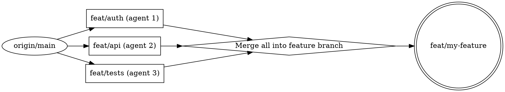

$ARGUMENTS

# Git Worktrees for Multi-Agent Development

Best practices for using git worktrees when multiple agents work on the same repo concurrently.

## What's Shared vs Isolated

Understanding this is critical for avoiding conflicts between agents.

| Layer | Shared? | Implication |
|-------|---------|-------------|
| Object store (`.git/objects/`) | Shared | Commits, blobs, trees are visible across all worktrees instantly |
| Refs (`refs/heads/`, `refs/tags/`) | Shared | Branch and tag names are global — one agent's commit is visible to all |
| Config (`.git/config`) | Shared | Config changes affect every worktree (unless `extensions.worktreeConfig` is on) |
| HEAD | Per worktree | Each worktree tracks its own checked-out branch |
| Index (staging area) | Per worktree | Each worktree has independent staging — concurrent `git add`/`commit` is safe |
| Working directory | Per worktree | File modifications are fully isolated |
| `refs/worktree/` | Per worktree | Use for worktree-local refs if needed |

**Key takeaway:** Two worktrees can commit to their own branches simultaneously without interference. But they cannot check out the same branch.

## The Branch Exclusivity Rule

**Each branch can only be checked out by one worktree at a time.** Git enforces this — attempting to check out a branch that's active in another worktree fails:

```
fatal: 'feature-x' is already used by worktree at '/path/to/other-worktree'
```

**For multi-agent work, this means:** every agent needs its own branch. Plan branch names before dispatching agents.

## Setup for Multi-Agent Work

### Directory Structure

Use a `.worktrees/` directory at the repo root (hidden, clean):

```bash
# Verify it's gitignored first
echo ".worktrees/" >> .gitignore  # if not already present
git check-ignore -q .worktrees || echo "WARNING: .worktrees not ignored"

# Create worktrees with descriptive names
git worktree add .worktrees/agent-1-auth -b feat/auth
git worktree add .worktrees/agent-2-api -b feat/api
git worktree add .worktrees/agent-3-tests -b feat/tests
```

### Naming Convention

```
.worktrees/<agent-role>-<task-slug>/
Branch: <prefix>/<task-slug>

Examples:
.worktrees/agent-backend-auth/     branch: feat/auth
.worktrees/agent-frontend-dashboard/ branch: feat/dashboard
.worktrees/agent-tests-e2e/        branch: feat/e2e-tests
```

### Branch Strategy



**Two patterns:**

**Pattern A — Separate branches per agent, merge at end:**
Each agent works on its own branch. PM merges them into a single feature branch when all agents finish. Best when agents touch different files.

```bash
# After all agents finish, merge from main worktree:
git checkout -b feat/my-feature origin/main
git merge feat/auth feat/api feat/tests
```

**Pattern B — Single feature branch, agents use worktrees on same branch:**
Not possible due to the branch exclusivity rule. Instead, agents work on sub-branches and merge sequentially.

```bash
# Agent 1 finishes first
git checkout feat/my-feature
git merge feat/auth

# Agent 2 rebases onto updated feature branch, then merges
# (PM coordinates this sequencing)
```

## Concurrent Operations — What's Safe

| Operation | Safe Concurrently? | Notes |
|-----------|--------------------|-------|
| `git add` + `git commit` on different branches | Yes | Separate indexes, separate HEADs |
| `git fetch` from multiple worktrees | Yes | Git uses lockfiles on refs; may briefly block but won't corrupt |
| `git push` from multiple worktrees | Yes | Pushes different branches; no conflict |
| `git rebase` on different branches | Yes | Each operates on its own branch |
| `git merge` into the same branch | No | Branch exclusivity prevents this |
| Modifying the same file across worktrees | Safe for git | Git doesn't care — files are per-worktree. Conflicts only appear at merge time. |
| `git gc` / `git prune` | Mostly safe | Git locks the object store, but aggressive GC during heavy concurrent work can cause transient errors. Avoid running manually. |
| `git config` changes | Affects all worktrees | Use `--worktree` flag or `extensions.worktreeConfig` for per-worktree config |

## Lifecycle Management

### Creating

```bash
# From the main worktree:
git worktree add <path> -b <branch> [<start-point>]

# Lock immediately if you don't want auto-pruning
git worktree add --lock --reason "agent-2 working" <path> -b <branch>
```

### Listing

```bash
# Human-readable
git worktree list

# Scriptable (porcelain)
git worktree list --porcelain
```

### Cleaning Up

```bash
# Proper removal (checks for uncommitted changes)
git worktree remove <path>

# Force removal (discards uncommitted changes)
git worktree remove -f <path>

# If a worktree was deleted manually (rm -rf), clean up stale metadata:
git worktree prune
```

**After removing a worktree, its branch still exists.** Delete it separately if no longer needed:

```bash
git worktree remove .worktrees/agent-1-auth
git branch -d feat/auth  # only if merged
git branch -D feat/auth  # force delete if unmerged
```

### Locking

Lock worktrees to prevent `git worktree prune` from cleaning them up:

```bash
git worktree lock .worktrees/agent-1-auth --reason "agent actively working"
git worktree unlock .worktrees/agent-1-auth
```

## Multi-Agent Orchestration Checklist

**Before dispatching agents:**
1. `.worktrees/` exists and is in `.gitignore`
2. Branch names planned — one per agent, no overlaps
3. File ownership boundaries defined — no two agents modify the same file
4. All worktrees created from the same base commit (typically `origin/main`)
5. Dependency install run in each worktree (they share no `node_modules`, `venv`, etc.)

**While agents work:**
- Each agent commits to its own branch in its own worktree
- PM monitors via `git worktree list` and branch logs
- If an agent needs another agent's work, PM cherry-picks or rebases — agents never cross into each other's worktrees

**After agents finish:**
1. Merge all agent branches into the feature branch (resolve conflicts)
2. Run full test suite on the merged result
3. Remove worktrees: `git worktree remove <path>`
4. Prune stale metadata: `git worktree prune`
5. Delete agent branches: `git branch -d <branch>`

## Common Pitfalls

### Forgetting dependency install per worktree

Worktrees share `.git` but NOT `node_modules/`, `.venv/`, `target/`, or any build artifacts. Each worktree needs its own dependency install.

```bash
# After creating each worktree:
cd .worktrees/agent-1-auth && npm install  # or pip install, cargo build, etc.
```

### Stale worktrees after `rm -rf`

If an agent's worktree is deleted without `git worktree remove`, git still tracks it. The branch becomes "stuck" — you can't check it out elsewhere.

```bash
# Fix: prune stale entries
git worktree prune -v

# Then the branch is free to use again
```

### Merge conflicts at integration time

When agents modify related (but different) files, merging can still produce conflicts in generated files (lockfiles, snapshots, codegen). Plan for a conflict-resolution step after merging agent branches.

### Running `git gc` during heavy concurrent work

Avoid manual `git gc` or `git prune` while agents are actively committing. Git's auto-gc is safe, but manual aggressive GC can cause transient "object not found" errors in concurrent worktrees.

### Config changes leaking across worktrees

`git config` changes in one worktree affect all worktrees (shared config). If an agent needs worktree-specific config:

```bash
git config extensions.worktreeConfig true
git config --worktree some.setting value
```

## Quick Reference

```bash
# Create worktree with new branch from latest main
git worktree add .worktrees/<name> -b <branch> origin/main

# List all worktrees
git worktree list

# Remove a worktree cleanly
git worktree remove .worktrees/<name>

# Clean up after manual deletion
git worktree prune

# Lock/unlock to prevent pruning
git worktree lock .worktrees/<name> --reason "reason"
git worktree unlock .worktrees/<name>

# Repair broken links after moving worktrees
git worktree repair
```
